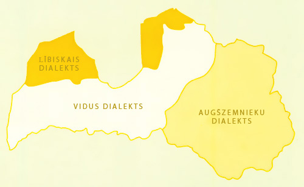
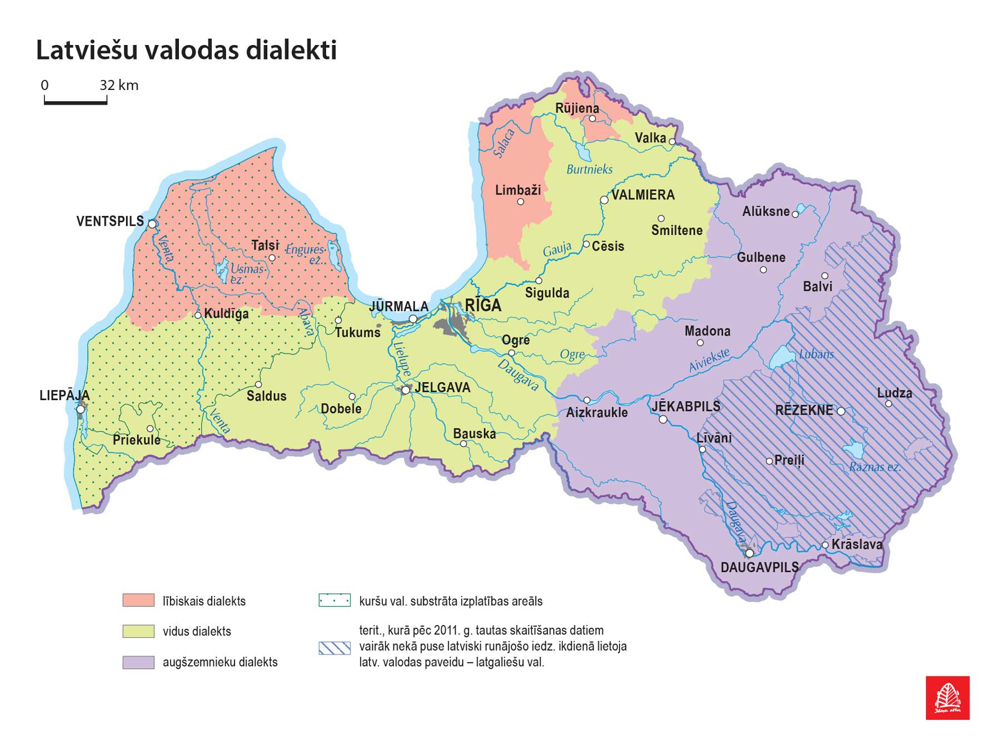
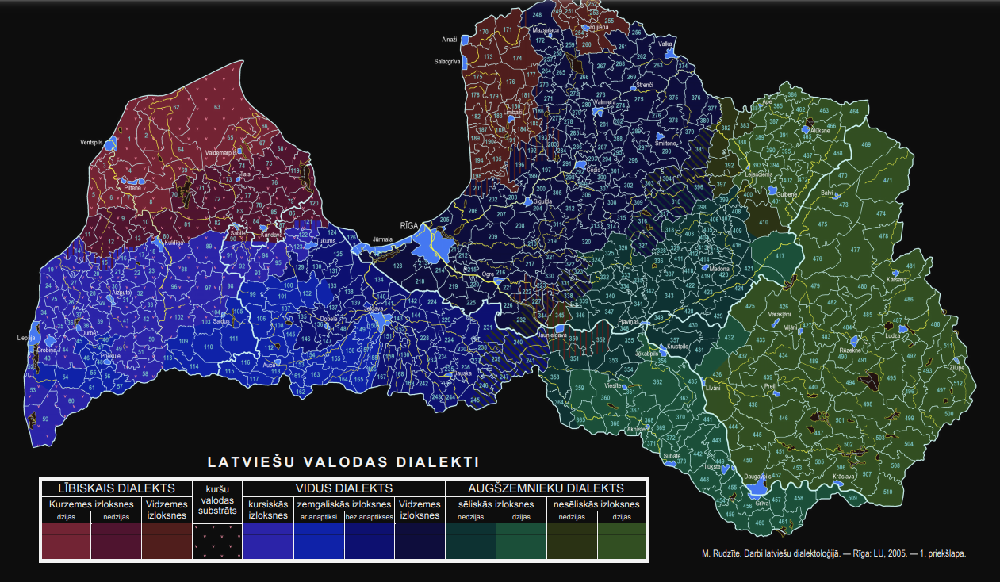

Итак, для начала разберемся, что такое диалект, потому что существуют несколько понятий и толкований этой формулировки.

Latviešu valodai ir:
1. teritoriālie paveidi (jeb dialekti) ir radniecīgu izlokšņu kopa. Конкретно в Латвии таковым можно назвать язык, на котором говорят в пределах одного прихода.
2. izloksnes ir nelielā apvidū runāto valodas paveidu

Izloksnes parasti rodas īpašu ģeogrāfisku, ekonomisku vai politisku apstākļu dēļ. Latviešu valodas izloksnes radušās ekonomisku un politisku apstākļu dēļ – dzimtbūšanas laikā latviešu zemniekiem netika dota iespēja pamest savas muižas teritoriju.

С лингвистической точки зрения довольно сложно прочерчивать однозначные линии между одним диалектом и другим, но для базового понимания в латышском языке trīs teritoriālos dialektus:

1. Vidus (На нем сформировался латышский литературный язык)
2. Lībisko (agrāk saukts par tāmnieku dialektu un kuru spēcīgi ietekmējusi lībiešu valoda)
3. Augšzemnieku (kurā uz Latgales izlokšņu pamata 18. gadsimtā izveidojās otra latviešu rakstības tradīcija – latgaliešu rakstu valoda.)

un vairāk nekā 500 izlokšņu

Kā teicis Kārlis Mīlenbahs: “Izloksnēs burbuļo mūsu valodas bagātība. No šā avota mums jo dienas, jo vairāk jāsmeļ. To darīdami, kuplināsim savu valodu ar īstām rotām.” Tik tiešām, izlokšņu vārdu krājums ir mūsu bagātība, kuru svarīgi saglabāt un nodot mantojumā nākamajām paaudzēm.