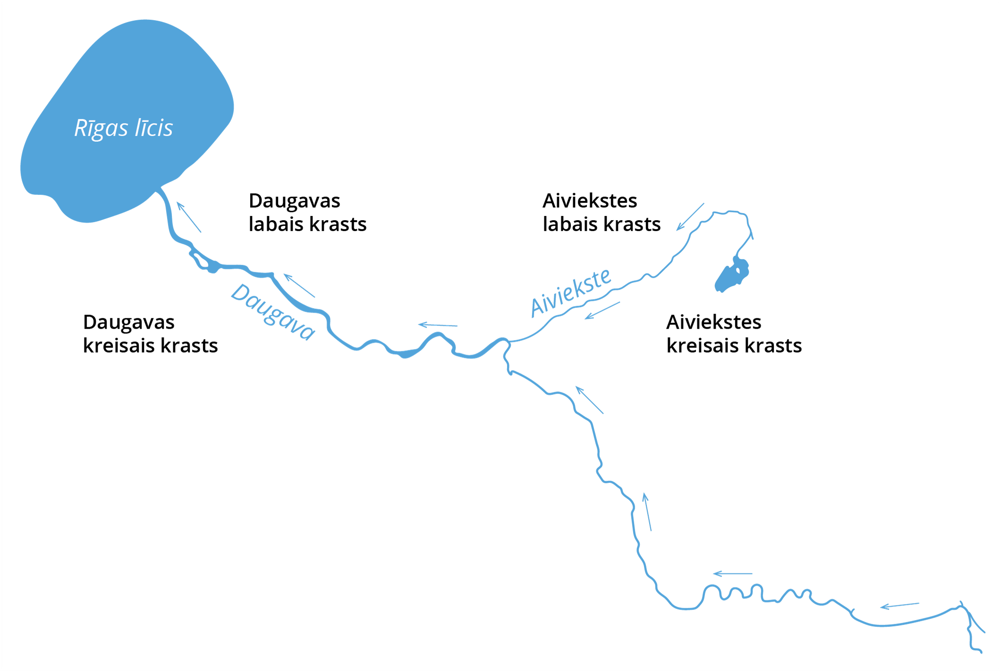
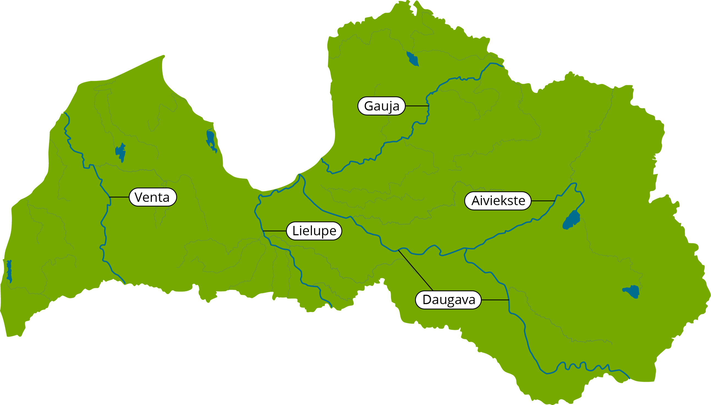
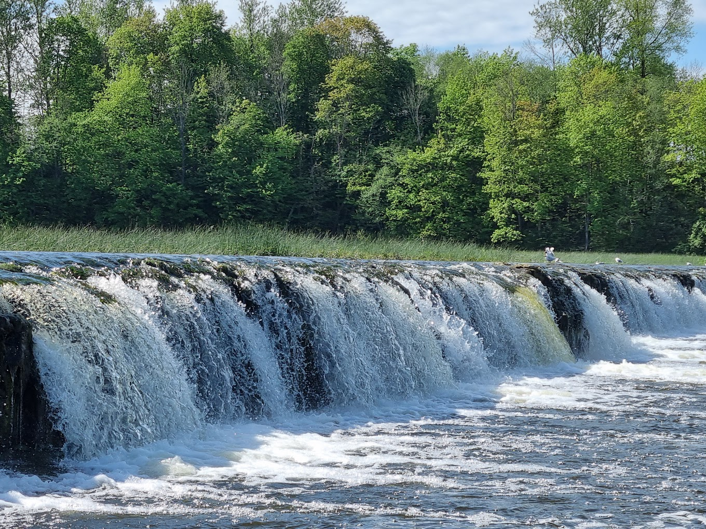
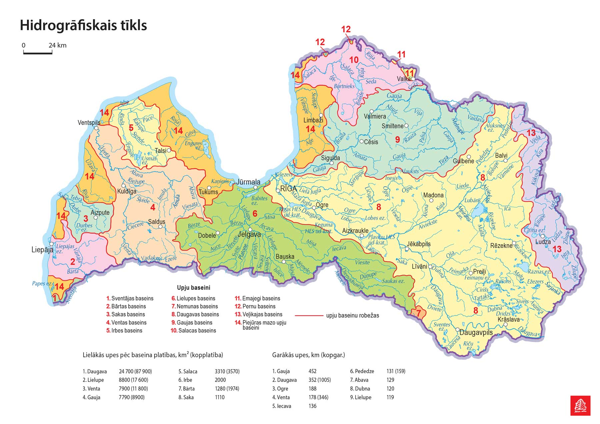
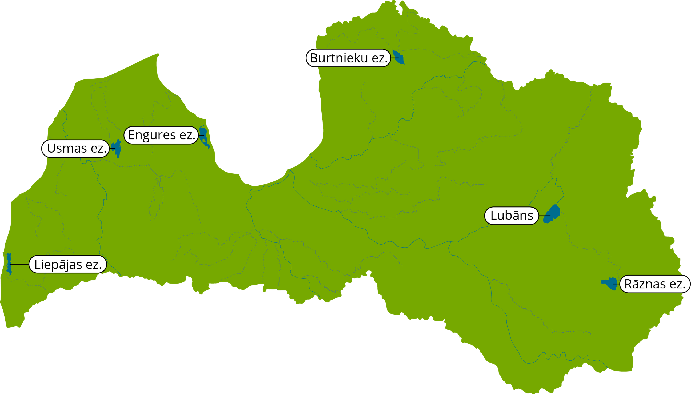

> Šodien pētīsim Latvijas iekšējos ūdeņus

Lai sāktu, atgādināsim sev skolas zināšanas:

- **Kas tas ir dabiskā ūdenstilpe?**

  Tas ir okeāns, jūra, upe, ezers, purvs, limāns, strauts – proti, tās ir ūdenstilpes, ko radījusi daba un kurās nav mākslīgas hidroizolācijas (atsauce). Ūdenstilpes dabiskā barošana notiek ar gruntsūdeņiem, avotiem, zemūdens straumēm utt.

- **Mākslīgā ūdenstilpe**

  Tās izcelsme ir tieši pretēja iepriekšminētajam. Cilvēki tās veido resursu uzkrāšanai un izmantošanai (parasti tautsaimniecībā), kas ir īpaši aktuāli karstā un sausā klimatā. Ir vairāki mākslīgo ūdenstilpju veidi: dekoratīvās, zivju audzētavas, ugunsdzēsības, sporta, rūpniecības u.c. Par mākslīgo ūdenstilpi var uzskatīt ūdenskrātuves, dīķus, baseinus, izstrādātus karjerus.

## Upe

### Ievads

Saldūdens ekosistēmas iedala lentiskās – **stāvoši ūdeņi** (ezeri un ūdenskrātuves), un lotiskās – **tekoši ūdeņi** (upes, strauti).

**Upe** ir dabiska ūdens plūsma, kas, pateicoties augstuma starpībai, plūst lejup tās izgrauztā gultnē, savāc virszemes un pazemes noteces ūdeņus no sava sateces baseina un ieplūst citā ūdenstilpē.

Ar upju pētīšanu nodarbojas **hidroloģija**. Šī zinātne ir plašāka, jo tā nodarbojas ar visu veidu ūdenstilpju izpēti. Nereti tiek apgalvots, ka ar upju izpēti nodarbojas **limnoloģija**, tomēr šo zinātni vairāk asociē ar ezeru izpēti.

1. Upes sākumu sauc par <u>IZTEKU</u>.
2. Vietu, kur upe ietek citā upē, ezerā vai jūrā, sauc par <u>IETEKU</u>.
3. Upes, kuras ietek citā upē, sauc par <u>PIETEKĀM</u>.
4. Latvijā ir daudz mazu un lielu upju. Tās ir <u>PLATAS</u> un <u>ŠAURAS</u>.
5. Krasts var būt <u>STĀVS</u> un <u>LĒZENS</u>.
6. Ūdens upē ir <u>TEKOŠS</u>. Tā varbūt <u>KRĀČAINA</u> un <u>MIERĪGA</u>.

- Upei ir <u>LABAIS</u> un <u>KREISAIS</u> krasts. To var noteikt, ja skatās vai nostājas upes tecēšanas virzienā (attēlā parādīts ar bultiņām). Pa labi ir labais krasts, pa kreisi - kreisais krasts.

Lielākās upes ir Daugava, Gauja, Venta, Lielupe un Aiviekste.

| Daugava | ir Latvijas lielākā upe. Tā tek cauri Daugavpilij, Jēkabpilij, Līvāniem, Rīgai.                                         |
| ------- | ----------------------------------------------------------------------------------------------------------------------- |
| Gauja   | ir garākā upe. Tā atrodas Vidzemē. Gauja tek cauri Valmierai un Siguldai.                                               |
| Lielupe | ir lielākā Zemgales upe, tai ir visvairāk pieteku. Tā tek cauri Jelgavai.                                               |
| Venta   | ir Kurzemes lielākā upe. Tai ir visplatākais ūdenskritums Eiropā **Venta rumba**. Venta tek cauri Kuldīgai, Ventspilij. |

Visu upju notece veidojas nokrišņu ietekmē, kas nonāk uz zemes virsmas. Ir četri galvenie upju barošanās veidi: **lietus ūdeņi, sniega kušana, ledāju kušana un pazemes (gruntsūdeņi).** Ir arī ezeru un purvu barošanās veidi, ja upes iztek no ezeriem vai purviem.

Jau izsenis strauju upju un ūdenskritumu enerģija tiek plaši izmantota cilvēka saimnieciskajā darbībā kā **atjaunojamās enerģijas avots**, lai darbinātu ūdens dzirnavas un hidroelektrostaciju turbīnas.

### Pirmsākumi

Latvijas upes ir ģeoloģiski jaunas; tās turpina iegrauzties iežos, transportējot un izgulsnējot erodēto materiālu. Upes veidojušās holocēnā; to veidošanās saistīta ar leduslaikmeta beigu posmu un pēcleduslaikmeta ūdenserozijas darbību pirms 10–11 tūkstošiem gadu. Tāpēc joprojām upju ielejas uzskata par neizveidotām, sevišķi tām upēm, kuru ielejas vai to posmi nesakrīt ar pirmskvartāra upju tīklu.

Latvijā ir apmēram **12 500** <u>upju, strautu un lielo grāvju</u>. Upju kopējais garums ir apmēram **37 500 km**, bet kopā ar grāvjiem <u>hidrogrāfiskā tīkla</u> kopgarums pārsniedz <u>100 000 kilometru</u>. Hidromeliorācijas rezultātā daudzas ūdensteces ir regulētas un iztaisnotas, kuru posmu kopgarums 2016. gadā sasniedza 13 366 km. No visu Latvijas upju kopgaruma 51 % veido upes, kuras ir īsākas par 10 km. Tikai 777 upes ir garākas par 10 km, no tām 17 upes ir garākas par 100 km. Upes raksturo arī baseina lielums un gada notece (1. tabula). Upju ūdensguves baseini nav lieli. Latvijā ir 213 upes, kurām ūdensguves baseins pārsniedz 100 km2, t. sk. 14 upēm tas sasniedz un pārsniedz 2000 km2.

#### **1. tabula. Latvijas lielākās upes**

> Avots: G. Kavacs (redaktors). Latvijas daba, 6. sējums. Rīga, 1998. Autoru veidota.

| Upe                                                   | Baseina platība, km2 |                     | Upes garums, km |                     | Gada notece, km3 |
| ----------------------------------------------------- | -------------------- | ------------------- | --------------- | ------------------- | ---------------- |
|                                                       | Kopējais             | Latvijas teritorijā | Kopējais        | Latvijas teritorijā |                  |
| [Daugava](https://enciklopedija.lv/skirklis/131859)   | 87 900               | 24 700              | 1005            | 352                 | 20,45            |
| Lielupe                                               | 17 600               | 8800                | 119             | 119                 | 3,56             |
| Venta                                                 | 11 800               | 6600                | 346             | 178                 | 2,94             |
| [Aiviekste](https://enciklopedija.lv/skirklis/137285) | 9300                 | 9160                | 114             | 114                 | 1,81             |
| Gauja                                                 | 9080a                | 7920                | 452             | 452                 | 2,24             |
| Mūsa                                                  | 5318                 | 120                 | 164             | 20                  | 0,83             |
| Mēmele                                                | 4050                 | 2110                | 191             | 116                 | 0,98             |
| Salaca                                                | 3420                 | 3190                | 95              | 95                  | 1,10             |
| Dubna                                                 | 2780                 | 2780                | 120             | 120                 | 0,56             |
| Svēte                                                 | 2380                 | 1873                | 123             | 73                  | 0,40             |
| Abava                                                 | 2042                 | 2042                | 129             | 129                 | 0,66             |
| Rēzekne                                               | 2066b                | 2066b               | 116             | 116                 | 0,49b            |
| Bārta                                                 | 1974                 | 1280                | 98              | 43                  | 0,69             |
| Irbe                                                  | 2000                 | 2000                | 32              | 21                  | 0,48             |
| Ogre                                                  | 1730                 | 1730                | 188             | 188                 | 0,57             |
| Pededze                                               | 1690                 | 1520                | 159             | 131                 | 0,44             |
| Dienvidsusēja                                         | 1210                 | 1190                | 114             | 114                 | 0,25             |
| Iecava                                                | 1166                 | 1166                | 136             | 136                 | 0,26             |
| Saka                                                  | 1110                 | 1110                | 6               | 6                   | 0,34             |

Upju ūdenīgumu raksturo gada vidējās noteces slāņa biezums, kas mainās no 160 mm Zemgales līdzenumā līdz 380 mm Rietumkursas un Vidzemes augstienēs. Latvijā vidējie ūdens bilances rādītāji: atmosfēras nokrišņi veido 703 mm, no tiem iztvaikošana – 458 mm un noteces slānis – 245 mm. Tas nozīmē, ka **lielākā daļa jeb 65 % no nokrišņiem iztvaiko no ūdens virsmām, zemes un augu segas un apmēram 35 % nokrišņu upes ienes Baltijas jūrā.**

## Ezers

### Ievads

**Ezers** ir dabiska ūdenstilpe reljefa pazeminājumos, kuru no visām pusēm norobežo sauszeme. Kaut gan praktiski visi ezeri ir pildīti ar ūdeni, par ezeriem sauc arī dabiskas tilpes, kas pildītas ar citu šķidru materiālu, piemēram, sēru. Ezers ir viens no nozīmīgākajiem ainavas elementiem, kas sastopams visos pasaules kontinentos. Ar ezeru izpēti nodarbojas īpaša zinātne [limnoloģija](https://lv.wikipedia.org/wiki/Limnolo%C4%A3ija "Limnoloģija"). Zemes virsmas daļu, kas veido ezera gultni, dēvē par ezerdobi.

Lielākā daļa pasaules ezeru pēc ģeoloģiskās laika skalas ir ļoti jauni — ezeri salīdzinājumā ar tādiem ainavas elementiem, kā **kalni, jūras, tuksneši**, pat **upes** ir ar salīdzinoši īsu mūžu. Dabiskie erozijas procesi gravitācijas spēku ietekmē tiecas pārvietot grunti no augstāk novietotām vietām uz zemāk novietotām vietām, tādējādi aizpildot ezerdobi.

Ezeri var būt  **DZIĻI** un **SEKLI**.  
Sauszemi ezerā sauc par **SALU**. Visvairāk salu ir <u>EŽEZERAM</u>.  
Latvijā vislielākais ezers ir **LUBĀNS**, visdziļākais – **DRIDZIS**.

Latvijas lielākie ezeri ir Lubāns, Rāznas, Burtnieku, Engures, Usmas un Liepājas ezers.

#### **2. tabula. Latvijas lielākie ezeri**
| Ūdens virsmas platība, km2                                 | Platība kopā ar salām, km2 | Baseina platība, km2 | Ūdens tilpums, mlj m3 | Atrašanās virs jūras līmeņa, m |       |
| ---------------------------------------------------------- | -------------------------- | -------------------- | --------------------- | ------------------------------ | ----- |
| [Lubāns](https://enciklopedija.lv/skirklis/51670)          | 80,70                      | 82,10                | 2180                  | 128                            | 92,5  |
| Rāznas ezers                                               | 57,56                      | 57,81                | 221                   | 405                            | 163,4 |
| Engures ezers                                              | 40,46                      | 47,31                | 644                   | 17                             | 0,3   |
| Burtnieks                                                  | 40,06                      | 40,07                | 2215                  | 88                             | 39,5  |
| [Usmas ezers](https://enciklopedija.lv/skirklis/32422)     | 37,20                      | 41,40                | 429                   | 190                            | 20,6  |
| Liepājas ezers                                             | 37,15                      | 37,51                | 2515                  | 37                             | 0,2   |
| Babītes ezers                                              | 25,56                      | 25,83                | 243                   | 23                             | 0,2   |
| Rušons                                                     | 23,73                      | 24,07                | 287                   | 69                             | 149,7 |
| Sīvers                                                     | 17,59                      | 18,12                | 68                    | 107                            | 159,4 |
| Ķīšezers                                                   | 17,30                      | 17,38                | 1900                  | 42                             | 0,1   |
| [Alūksnes ezers](https://enciklopedija.lv/skirklis/136009) | 15,44                      | 15,57                | 28,4                  | 109                            | 183,7 |
| Riču ezers                                                 | 12,83a                     | 12,9b                | 123                   | 124                            | 146,2 |
| Cirma ezers                                                | 12,61                      | -                    | 52,8                  | 38                             | 138,4 |
| Papes ezers                                                | mainīga                    | 12,1                 | 231                   | 3                              | 0,1   |
| [Kaņieris](https://enciklopedija.lv/skirklis/40647)        | 11,28                      | 11,4                 | 330                   | 7                              | 2,2   |
| Ežezers                                                    | 9,88                       | 10,7                 | 120                   | 61                             | 169,4 |
#### **3. tabula. Dziļākie ezeri.**

|                         | Dziļums, m |          |
| ----------------------- | ---------- | -------- |
|                         | Lielākais  | Vidējais |
| Drīdzis                 | 63,1*      | 12,8     |
| Garais ezers            | 56         | 16,5     |
| Geraņimovas Ilzas ezers | 46         | 9,8      |
| Ormijas ezers           | 43         | 9,4      |
| Ojatu ezers             | 40,5       | 9,2      |
| Ušas ezers              | 40         | 6,6      |

## Saimnieciskā izmantošana

Virszemes ūdeņus izmanto ūdens ņemšanai un notekūdeņu novadīšanai, kuru apjomi kopš 1991. gada ievērojami samazinājušies. No saimniecības nozarēm ūdeni visvairāk (kopā ar pazemes ūdeņiem) patērē **komunālā saimniecība**, **rūpniecība** un **lauksaimniecība**. Nozīmīga ir upju izmantošana enerģētikā. Latvijas potenciālie hidroresursi ir <u>7,2 TWh gadā</u>, tehniski pieejamie – 4 TWh gadā, bet ekonomiski pieejamie – 3,9 TWh gadā. Ūdenstilpes izmanto **zivsaimniecībā** un **rekreācijā** (makšķerēšana, ūdens tūrisms u. c.). Publiskie ūdeņi (noteikti 207 ezeri un 42 upes) aizņem 93 785,2 ha, kas veido 40,8 % no kopējās valsts ūdeņu platības. Ūdenstransporta nozīme kopš 20. gs. beigām būtībā zudusi. Daugavas un Ventas lejtecēs atrodas lielākās Latvijas jūras ostas.
Daudzos ezeros nogulsnējas dūņas un sapropelis, kam ir saimnieciska nozīme.
