## Valstspilsētas

| Nosaukums                                                             | Ģerbonis                    | Statusa   piešķiršanas gads | IedzīvotÄju skaits (2024) |
| --------------------------------------------------------------------- | --------------------------- | ------------------------------ | ------------------------- |
| [Daugavpils](https://lv.wikipedia.org/wiki/Daugavpils "Daugavpils")   |    | 1940                           | 77 799                    |
| [Jēkabpils](https://lv.wikipedia.org/wiki/J%C4%93kabpils "Jēkabpils") |      | 2009                           | 21 150                    |
| [Jelgava](https://lv.wikipedia.org/wiki/Jelgava "Jelgava")            | 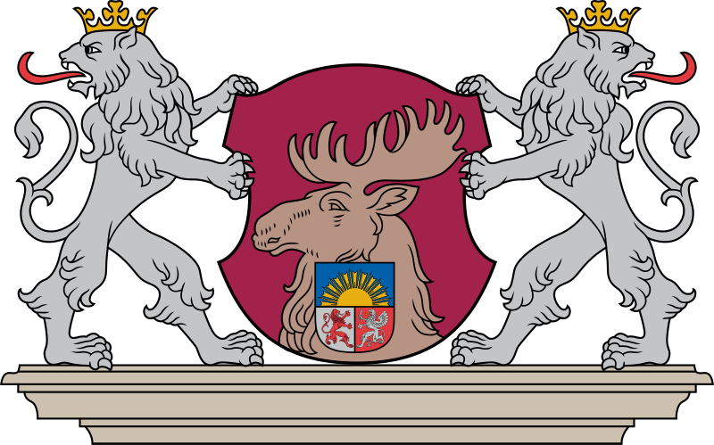     | 1940                           | 54 701                    |
| [Jūrmala](https://lv.wikipedia.org/wiki/J%C5%ABrmala "Jūrmala")       | 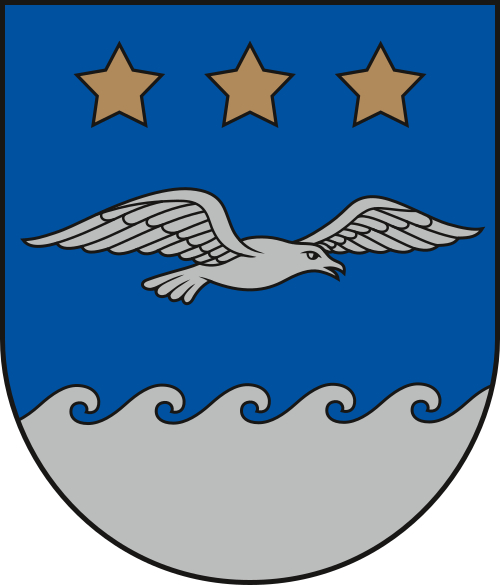        | 1959                           | 52 154                    |
| [LiepÄja](https://lv.wikipedia.org/wiki/Liep%C4%81ja "LiepÄja")       |          | 1940                           | 66 680                    |
| [Ogre](https://lv.wikipedia.org/wiki/Ogre "Ogre")                     |             | 2021                           | 22 767                    |
| [Rēzekne](https://lv.wikipedia.org/wiki/R%C4%93zekne "Rēzekne")       |          | 1952                           | 26 131                    |
| [Rīga](https://lv.wikipedia.org/wiki/R%C4%ABga "Rīga")                |             | 1931                           | 605 273                   |
| [Valmiera](https://lv.wikipedia.org/wiki/Valmiera "Valmiera")         |        | 2009                           | 22 376                    |
| [Ventspils](https://lv.wikipedia.org/wiki/Ventspils "Ventspils")      | 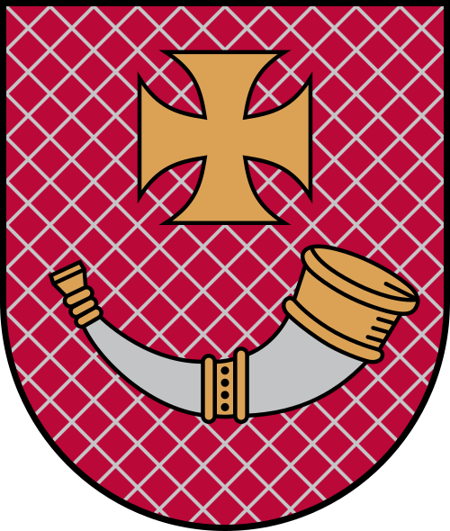 | 1940                           | 32 634                    |

## Terminu skaidrojums

- **Novads** – ir liela administratīvā vienība Latvijā, līdzīga apgabaliem vai reģioniem citās valstīs. **Novadi** ietver vairākas pilsētas un pagastus, kā arī citus mazākus apdzīvotos punktus. Piemēram, **Kuldīgas novads** sastāv no Kuldīgas pilsētas un Skrundas, kā arī Alsungas pagasta, kurā atrodas Alsunga (centrs) un Reģi (ciems).

- **Pagasts** – ir administratīva vienība zem **novads** līmeņa, kas parasti ietver lauku teritorijas vai mazākus ciematus. **Pagasts** ir līdzīgs pašvaldību rajoniem vai lauku novadiem citās valstīs.

- **Pilsēta** – ir patstāvīga administratīvā vienība, kas var būt daļa no **novads** vai darboties kā atsevišķa administratīva vienība. Lielākas pilsētas, piemēram, Rīga vai Liepāja, ir ar savu administratīvo statusu.

- **Pilsētas novads** – ir novads, kas ietver gan pilsētas, gan piepilsētas teritorijas. Šādi novadi ietver vienu lielu pilsētu un tai piegulošās teritorijas.
## Novadi

| Novads                                                                                           | Ģerbonis                        | Pilsetas                                                                                                                  | Iedzīvotāju  skaits (2024) |
| ------------------------------------------------------------------------------------------------ | ------------------------------- | ------------------------------------------------------------------------------------------------------------------------- | -------------------------- |
| [Ä€dažu](https://lv.wikipedia.org/wiki/%C4%80da%C5%BEu_novads "Ä€dažu novads")                     | 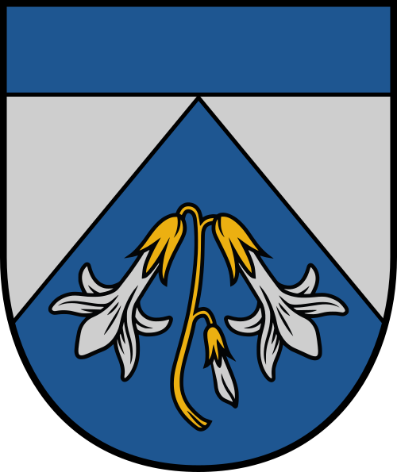               | [Ä€daži](https://lv.wikipedia.org/wiki/%C4%80da%C5%BEi "Ä€daži")                                                      | 23 281                     |
| [Aizkraukles](https://lv.wikipedia.org/wiki/Aizkraukles_novads "Aizkraukles novads")             |        | [Aizkraukle](https://lv.wikipedia.org/wiki/Aizkraukle "Aizkraukle") Jaunjelgava Koknese Pļaviņas     | 28 618                     |
| [Alūksnes](https://lv.wikipedia.org/wiki/Al%C5%ABksnes_novads "Alūksnes novads")                 |              | [Alūksne](https://lv.wikipedia.org/wiki/Al%C5%ABksne "Alūksne")                                                           | 13 059                     |
| [Augšdaugavas](https://lv.wikipedia.org/wiki/Aug%C5%A1daugavas_novads "Augšdaugavas novads")     | 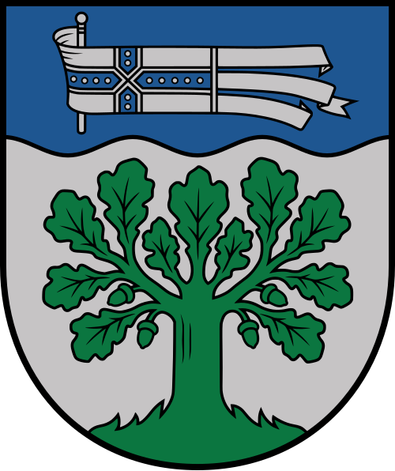 | [Daugavpils](https://lv.wikipedia.org/wiki/Daugavpils "Daugavpils") Ilūkste Subate                               | 24 361                     |
| [Balvu](https://lv.wikipedia.org/wiki/Balvu_novads "Balvu novads")                               |              | [Balvi](https://lv.wikipedia.org/wiki/Balvi)   Viļaka                                       | 17 910                     |
| [Bauskas](https://lv.wikipedia.org/wiki/Bauskas_novads "Bauskas novads")                         |          | [Bauska](https://lv.wikipedia.org/wiki/Bauska)   Iecava                                        | 40 906                     |
| [Cēsu](https://lv.wikipedia.org/wiki/C%C4%93su_novads "Cēsu novads")                             |                | [Cēsis](https://lv.wikipedia.org/wiki/C%C4%93sis "Cēsis") Līgatne                                                      | 40 943                     |
| [Dienvidkurzemes](https://lv.wikipedia.org/wiki/Dienvidkurzemes_novads "Dienvidkurzemes novads") |    | [Grobiņa](https://lv.wikipedia.org/wiki/Grobi%C5%86a "Grobiņa") Aizpute Durbe PÄvilosta Priekule              | 32 708                     |
| [Dobeles](https://lv.wikipedia.org/wiki/Dobeles_novads "Dobeles novads")                         |          | [*Dobele*](https://lv.wikipedia.org/wiki/Dobele "Dobele") Auce                                                         | 27 474                     |
| [Gulbenes](https://lv.wikipedia.org/wiki/Gulbenes_novads "Gulbenes novads")                      | 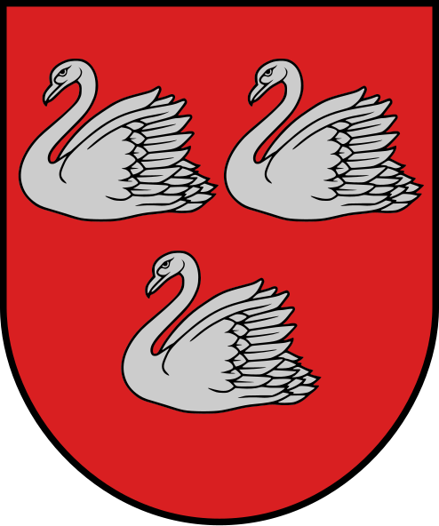       | [Gulbene](https://lv.wikipedia.org/wiki/Gulbene)                                                                          | 18 740                     |
| [Jēkabpils](https://lv.wikipedia.org/wiki/J%C4%93kabpils_novads "Jēkabpils novads")              | 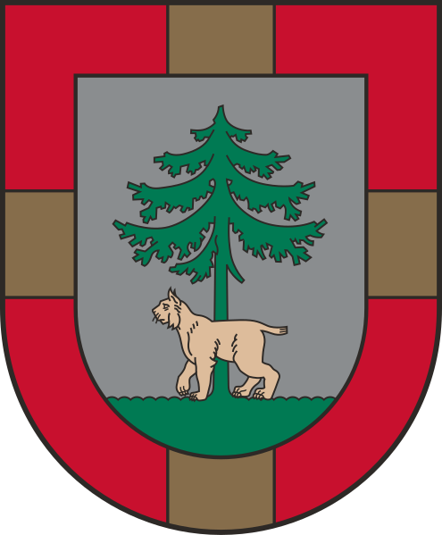     | [Jēkabpils](https://lv.wikipedia.org/wiki/J%C4%93kabpils) Aknīste Viesīte                         | 39 276                     |
| [Jelgavas](https://lv.wikipedia.org/wiki/Jelgavas_novads "Jelgavas novads")                      | 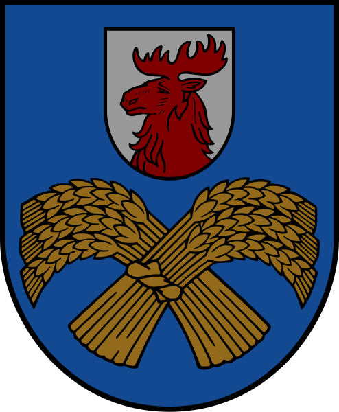       | [Jelgava](https://lv.wikipedia.org/wiki/Jelgava)                                                                          | 32 053                     |
| [KrÄslavas](https://lv.wikipedia.org/wiki/Kr%C4%81slavas_novads "KrÄslavas novads")              |        | [*KrÄslava*](https://lv.wikipedia.org/wiki/Kr%C4%81slava "KrÄslava") Dagda                                             | 19 833                     |
| [Kuldīgas](https://lv.wikipedia.org/wiki/Kuld%C4%ABgas_novads "Kuldīgas novads")                 |          | [*Kuldīga*](https://lv.wikipedia.org/wiki/Kuld%C4%ABga "Kuldīga") Skrunda                                              | 26 956                     |
| [Ķekavas](https://lv.wikipedia.org/wiki/%C4%B6ekavas_novads "Ķekavas novads")                    | 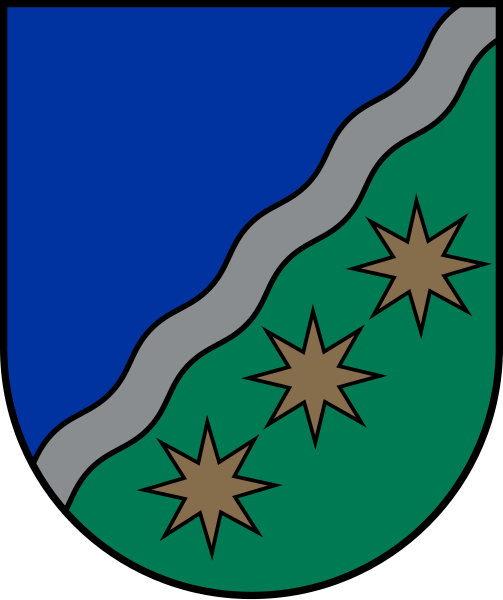         | [Ķekava](https://lv.wikipedia.org/wiki/%C4%B6ekava "Ķekava") Baldone Baloži                                      | 31 303                     |
| [Limbažu](https://lv.wikipedia.org/wiki/Limba%C5%BEu_novads "Limbažu novads")                    |          | [Limbaži](https://lv.wikipedia.org/wiki/Limba%C5%BEi "Limbaži") Ainaži Aloja Limbaži Salacgrīva Staicele   | 27 852                     |
| [LīvÄnu](https://lv.wikipedia.org/wiki/L%C4%ABv%C4%81nu_novads "LīvÄnu novads")                  | 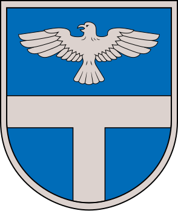           | [LīvÄni](https://lv.wikipedia.org/wiki/L%C4%ABv%C4%81ni)                                                                  | 10 215                     |
| [Ludzas](https://lv.wikipedia.org/wiki/Ludzas_novads "Ludzas novads")                            | 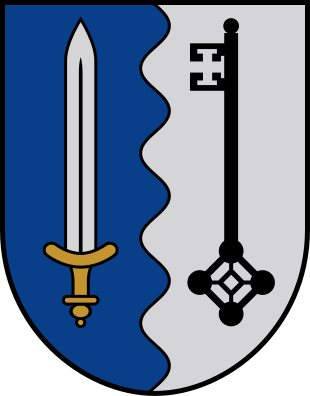           | [Ludza](https://lv.wikipedia.org/wiki/Ludza) KÄrsava Zilupe                                                         | 20 745                     |
| [Madonas](https://lv.wikipedia.org/wiki/Madonas_novads "Madonas novads")                         | 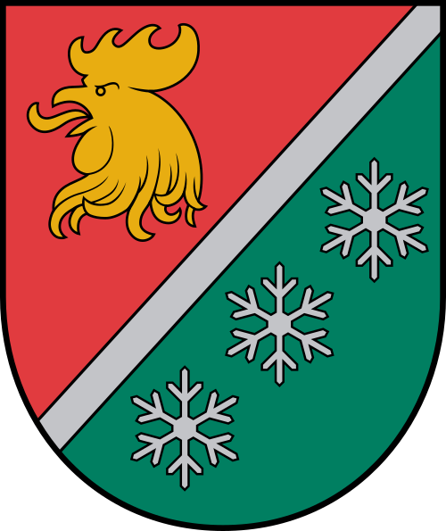           | [Madona](https://lv.wikipedia.org/wiki/Madona "Madona") Cesvaine LubÄna                                             | 27 255                     |
| [MÄrupes](https://lv.wikipedia.org/wiki/M%C4%81rupes_novads "MÄrupes novads")                    | 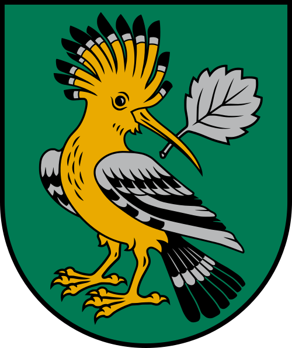         | [MÄrupe](https://lv.wikipedia.org/wiki/M%C4%81rupe "MÄrupe")                                                              | 37 025                     |
| [Ogres](https://lv.wikipedia.org/wiki/Ogres_novads "Ogres novads")                               |                | [Ogre](https://lv.wikipedia.org/wiki/Ogre) Ikšķile Ķegums LielvÄrde                                              | 57 689                     |
| [Olaines](https://lv.wikipedia.org/wiki/Olaines_novads "Olaines novads")                         |           | [Olaine](https://lv.wikipedia.org/wiki/Olaine)                                                                            | 20 658                     |
| [Preiļu](https://lv.wikipedia.org/wiki/Prei%C4%BCu_novads "Preiļu novads")                       |            | [Preiļi](https://lv.wikipedia.org/wiki/Prei%C4%BCi)                                                                       | 15 768                     |
| [Rēzeknes](https://lv.wikipedia.org/wiki/R%C4%93zeknes_novads "Rēzeknes novads")                 |        | [Rēzekne](https://lv.wikipedia.org/wiki/R%C4%93zekne) Viļāni                                                           | 28 305                     |
| [Ropažu](https://lv.wikipedia.org/wiki/Ropa%C5%BEu_novads "Ropažu novads")                       |            | [Ulbroka](https://lv.wikipedia.org/wiki/Ulbroka "Ulbroka") Vangaži                                                     | 35 178                     |
| [Salaspils](https://lv.wikipedia.org/wiki/Salaspils_novads "Salaspils novads")                   |      | [Salaspils](https://lv.wikipedia.org/wiki/Salaspils "Salaspils")                                                          | 23 694                     |
| [Saldus](https://lv.wikipedia.org/wiki/Saldus_novads "Saldus novads")                            |            | [Saldus](https://lv.wikipedia.org/wiki/Saldus "Saldus") Brocēni                                                        | 26 320                     |
| [Saulkrastu](https://lv.wikipedia.org/wiki/Saulkrastu_novads "Saulkrastu novads")                |    | [Saulkrasti](https://lv.wikipedia.org/wiki/Saulkrasti "Saulkrasti")                                                       | 9926                       |
| [Siguldas](https://lv.wikipedia.org/wiki/Siguldas_novads "Siguldas novads")                      |          | [Sigulda](https://lv.wikipedia.org/wiki/Sigulda "Sigulda")                                                             | 31 469                     |
| [Smiltenes](https://lv.wikipedia.org/wiki/Smiltenes_novads "Smiltenes novads")                   | 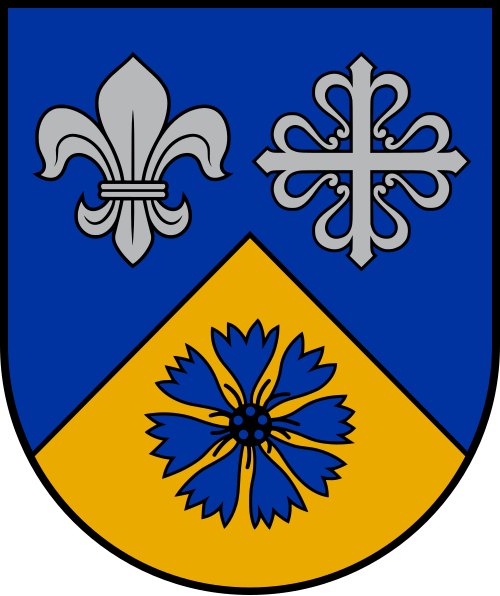       | [Smiltene](https://lv.wikipedia.org/wiki/Smiltene "Smiltene") Ape                                                      | 17 697                     |
| [Talsu](https://lv.wikipedia.org/wiki/Talsu_novads "Talsu novads")                               |              | [Talsi](https://lv.wikipedia.org/wiki/Talsi) Sabile Stende ValdemÄrpils                                          | 34 675                     |
| [Tukuma](https://lv.wikipedia.org/wiki/Tukuma_novads "Tukuma novads")                            | 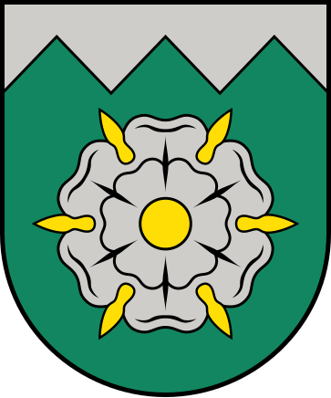           | [Tukums](https://lv.wikipedia.org/wiki/Tukums) Kandava                                                                 | 43 641                     |
| [Valkas](https://lv.wikipedia.org/wiki/Valkas_novads "Valkas novads")                            | 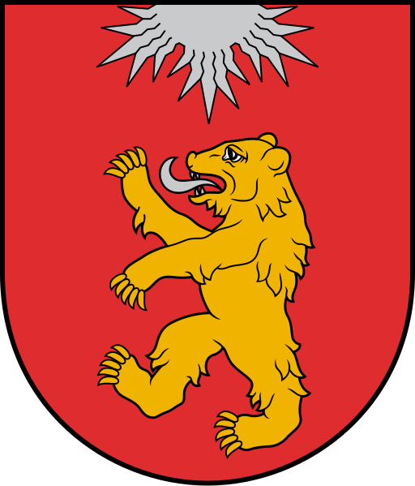             | [Valka](https://lv.wikipedia.org/wiki/Valka)                                                                              | 7501                       |
| [Valmieras](https://lv.wikipedia.org/wiki/Valmieras_novads "Valmieras novads")                   |        | [Valmiera](https://lv.wikipedia.org/wiki/Valmiera "Valmiera") Mazsalaca Rūjiena Seda StrenÄi                  | 50 283                     |
| [Varakļānu](https://lv.wikipedia.org/wiki/Varak%C4%BC%C4%81nu_novads "Varakļānu novads")         |      | [Varakļāni](https://lv.wikipedia.org/wiki/Varak%C4%BC%C4%81ni "Varakļāni")                                             | 2890                       |
| [Ventspils](https://lv.wikipedia.org/wiki/Ventspils_novads "Ventspils novads")                   |   | [Ventspils](https://lv.wikipedia.org/wiki/Ventspils) Piltene                                                           | 10 303                     |

## Vēsturiskās zemes

| Novads                                                       | Ģerbonis                                                                                                                                                                                                             | Karogs                                                                                                                                                                                                       |
| ------------------------------------------------------------ | -------------------------------------------------------------------------------------------------------------------------------------------------------------------------------------------------------------------- | ------------------------------------------------------------------------------------------------------------------------------------------------------------------------------------------------------------ |
| [Kurzeme](https://lv.wikipedia.org/wiki/Kurzeme "Kurzeme")   |              | _nav_                                                                                                                                                                                                        |
| [Latgale](https://lv.wikipedia.org/wiki/Latgale "Latgale")   |              |  |
| [Sēlija](https://lv.wikipedia.org/wiki/S%C4%93lija "Sēlija") |  |                 |
| [Vidzeme](https://lv.wikipedia.org/wiki/Vidzeme "Vidzeme")   |              | _nav_                                                                                                                                                                                                        |
| [Zemgale](https://lv.wikipedia.org/wiki/Zemgale "Zemgale")   |              |  |

