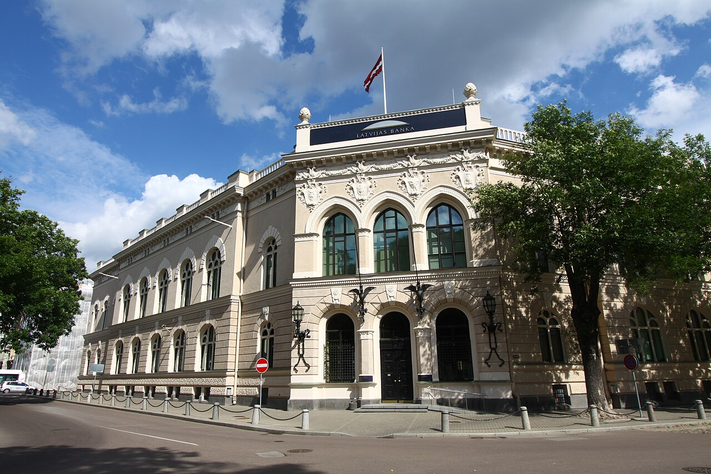

## Краткий обзор экономической системы Латвии
- Из чего состоит и как функционирует?
- Современная структура экономики Латвии
## Основные отрасли
- Сельское и лесное хозяйство
- Промышленность: деревообработка, пищевая, фармацевтика.
- Услуги: транспорт, логистика, IT
- Латвийские банки
## Роль экспорта и международной торговли:
- Основные партнёры
- Экспорт продукции: древесина, продукты питания, металлы.
## Латвия в мировой экономике
- Участие в Европейском союзе и Еврозоне
- Рейтинг Латвии по экономической свободе и конкурентоспособности.
- Привлечение иностранных инвестиций: что делает Латвия привлекательной.
## Перспективы развития экономики
- Инновации и стартапы: роль IT-сектора.
- Устойчивое развитие: переход к зелёной экономике.
- Как Латвия адаптируется к новым глобальным вызовам.
### Заключение

- Экономика как основа стабильности и независимости Латвии.
- Личный взгляд на экономические изменения в стране.
- Как экономика Латвии связана с её культурой и традициями.
