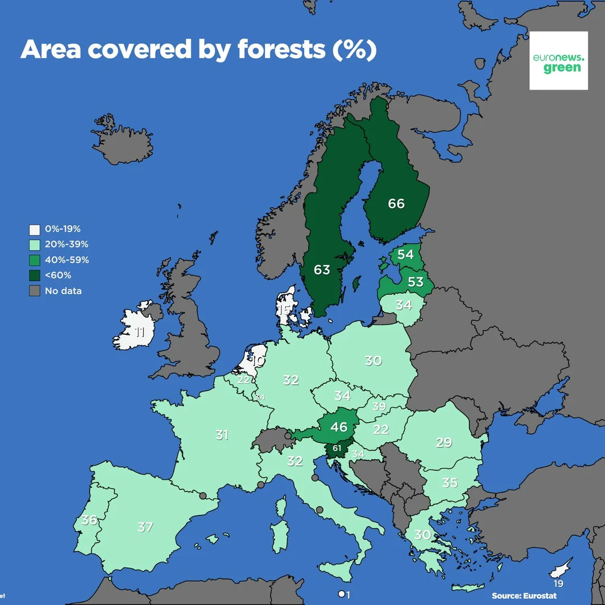

Latvija ir viena no vismežainākajām valstīm Eiropā. Meži aizņem 53% valsts teritorijas, kas ir divreiz vairāk nekā 1923. gadā. Galvenās koku sugas ir skujkoki, piemēram, priede un egle, kas sedz 55% mežu teritorijas. Latvija turpina palielināt mežu platības, tostarp pateicoties lauksaimniecības zemju dabiskai aizaugšanai.

**AS «Latvijas Valsts Meži» (LVM)** — valsts uzņēmums, kas pārvalda 1,6 miljonus hektāru meža zemju, spēlē būtisku lomu meža resursu pārvaldībā. Katru gadu tiek atjaunoti tūkstošiem hektāru mežu, kas ne tikai saglabā ekoloģisko līdzsvaru, bet arī veicina valsts ekonomisko izaugsmi, pateicoties meža resursu eksportam. Vidēji tiek izcirsti tikai 69% no gada pieauguma, tādēļ ekonomiski pieejamie meža resursi Latvijā pieaug. Tā ir svarīga Latvijas ekonomikas daļa, kas nodrošina darba vietas un ienākumus gan no koksnes pārdošanas iekšējā, gan ārējā tirgū.

Важно
> 2018.gadā atjaunojusi valsts mežus 8800 hektāru platībā, iestādot 24,5 miljonus jaunu koku jeb vairāk nekā 12 kokus uz katru Latvijas iedzīvotāju. Kopumā gadā valsts meži atjaunoti 15 200 hektāru platībā.

  

<iframe width="964" height="534" src="https://ec.europa.eu/eurostat/statistics-explained/index.php?action=statexp-dc-display&title=Forests,_forestry_and_logging" scrolling="yes" frameborder="0"></iframe>

  

